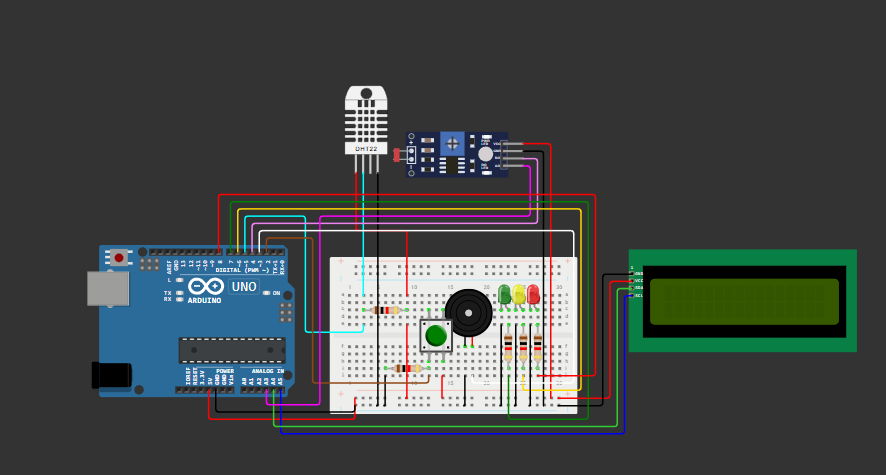
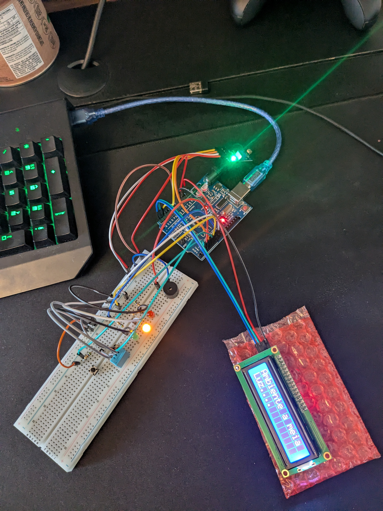

# EdgeComputing-CP03
### Monitorador de Adega // Wine Cellar Monitor
Projeto feito baseado no caso ficticio da Vinharia do Agnello. Criamos um monitorador de temperatura, umidade e luminosidade de um ambiente utlizando um Arduino.

Dados são exibidos através da tela LCD e indicadores dos status são demonstrados por LEDs vermelho, amarelo e verde. Além de um buzzer para alertar usuários em situações criticas.

Um botão extra foi incluido no projeto para mudar entre os dados exibidos na tela LCD quando quiser.

## Video explicativo 3min:
### https://youtube.com/shorts/onf-w1yfink?feature=share

## Circuito // Wiring

## Pseudo Codigo
Ler valores dos sensores a cada 1 segundo

Guardar os ultimos 5 valores em uma lista

Calcular a media dos ultimos 5 valores de cada sensor

Se todos os valores estiverem dentro dos padrões, mostar a média dos sensores na tela LCD, mudando entre os elementos a cada 5 segundos.

Se uma ou mais médias dos sensores estiverem fora dos valores padrões ou pré-determinados, ativar alarme.

Se alarme estiver ativo, mostrar o(s) valores fora do padrão na tela LCD (caso seja mais de um valor, mudar entre eles a cada 5 segundos), acionar LEDs correspondentes ao problema e acionar o Buzzer periodicamente a cada 1 segundo.

## Peças utlizadas

- Arduino
- Protoboard
- Tela LCD I2C
- Sensor de Luz
- DHT 11
- Buzzer
- 3 Leds (vermelho, amarelo e verde)
- Botão
- 5 resistores
- 24 Jumper Cables (16 macho-macho, 8 macho-femea)

## Codigo: 
### [Link para arquivo do Codigo utilizado no Arduino](EdgeComputing_CP03_ControleDeAdega.c)

## Montagem Fisica: 
